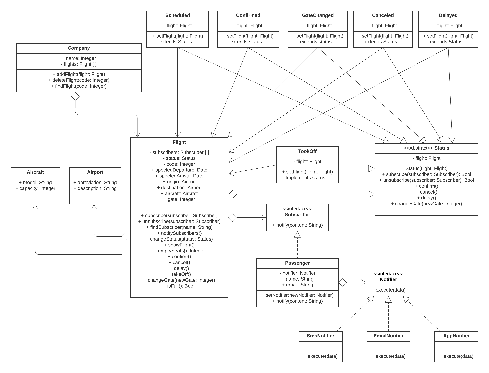

# NotifyAir
 Atividade da disciplina Padrões de Projeto de Software utilizando os padrões State, Observer e Strategy.

## Padrões de Projeto

- **State** foi aplicado para conseguir manipular as ações de um vôo que podem mudar a depender do seu status.
	> Classes: Flight(Contexto), Status(Abstrato), Scheduled, Confirmed, GateChanged, Canceled, Delayed e TookOff.

- **Observer** utilizado com o objetivo de notificar todos as pessoas inscritas no vôo (por enquanto apenas passageiros) a respeito das mudanças no estado do mesmo.
	> Classes: Flight(Contexto), Subscriber(Interface) e Passenger.

- **Strategy** implementado com o propósito de selecionar a maneira desejada pelo passageiro para ser notificado.
    > Classes: Passenger(Contexto), Notifier(Interface), SmsNotifier, EmailNotifier e AppNotifier.

## Diagrama de Classes
 